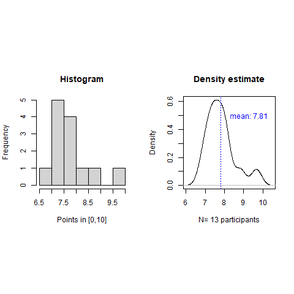
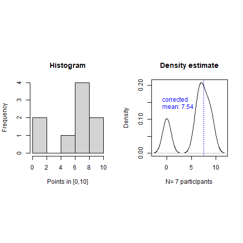
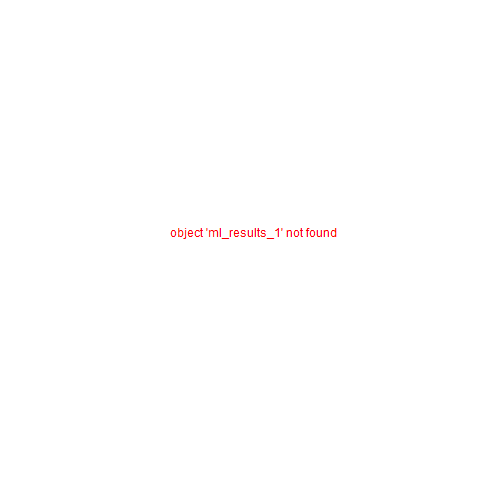

# Table of Contents

1.  [Introduction to programming CSC 100](#org5478c27)
2.  [Introduction to advanced data science DSC 205](#org37f2b43)
3.  [Machine learning DSC 305](#org9cf64ee)
4.  [Digital humanities CSC 105](#org1a19aaf)

# Introduction to programming CSC 100

-   This section contains visualization of test results for the
    Introduction to Programming class CSC 100 in Spring 2023.

-   The  visualizations were  created with  the statistical  programming
    language  R. If  you want  to know  more about  R or  even learn  it
    (fast), check out this excellent  tutorial by Norm Matloff, "fasteR:
    Fast Lane to Learning R!" for non-computer scientists.

## Getting the data

Save test results to data frames:

-   Save directory and individual files
-   `paste` and save as `file` string for `read.csv`
-   import with `read.csv`, `header=TRUE` and `stringsAsFactors=TRUE`.
    
        cc_dir <- c("w:/My Drive/spring23/cc/grades/")
        
        cc_test_1="2023-01-23T2039_Grades-CSC_100.csv"
        
        file_1 <- paste(cc_dir,cc_test_1,sep="")
        
        cc_test_1 <- read.csv(file_1, header=TRUE, stringsAsFactors=TRUE)
        
        cc_results_1 <- na.omit(cc_test_1$"Test.1..6701."[2:15])
        cc_results_1
    
         [1] 8.83 7.50 8.00 7.33 7.50 9.67 7.08 7.83 7.17 8.00 7.67 6.83 8.17
        attr(,"na.action")
        [1] 14
        attr(,"class")
        [1] "omit"

## Plotting the data

Density distribution plotting:

-   compute the averages for each results vector
-   determine min and max values for the plotting window
-   plot densities and averages and attach text labels
    
        cc_avg_1 <- mean(cc_results_1);
        cc_density_1 <- density(cc_results_1)
        
        par(mfrow=c(1,2),pty='s')
        hist(x=cc_results_1,
             main="Histogram",
             xlab="Points in [0,10]")
        
        plot(x=cc_density_1, col="black",
             main="Density estimate",
             xlab=paste("N=",length(cc_results_1),"participants"))
        abline(v=cc_avg_1, col="blue", lty=3)
        text(x=8.3, y=0.5, adj=0,
             col="blue",
             label=paste("mean:",format(cc_avg_1,digits=3)));
    
    

# Introduction to advanced data science DSC 205

-   This section contains visualization of test results for the
    "Introduction to advanced data science" class DSC 205 in
    Spring 2023.

## Getting the data

Save test results to data frames:

-   Save directory and individual files
-   `paste` and save as `file` string for `read.csv`
-   import with `read.csv`, `header=TRUE` and `stringsAsFactors=TRUE`.
    
        ds2_dir <- c("w:/My Drive/spring23/ds2/grades/")
        
        ds2_test_1="2023-01-24T0752_Grades-DSC_205.csv"
        
        file_1 <- paste(ds2_dir,ds2_test_1,sep="")
        
        ds2_test_1 <- read.csv(file_1, header=TRUE, stringsAsFactors=TRUE)
        
        ds2_results_1 <- na.omit(ds2_test_1$"Test.1..6557."[2:12])
        ds2_results_1
    
        [1] 6.75 9.25 6.75 7.25 8.75 0.00 6.00 8.00 0.00
        attr(,"na.action")
        [1] 10 11
        attr(,"class")
        [1] "omit"

## Plotting the data

Density distribution plotting:

-   compute the averages for each results vector (without non-test
    results, i.e. course participants who missed the test)
-   determine min and max values for the plotting window
-   plot densities and averages and attach text labels
    
        ds2_avg_1 <- mean(ds2_results_1[-which(ds2_results_1==0)]);
        ds2_density_1 <- density(ds2_results_1)
        
        par(mfrow=c(1,2),pty='s')
        hist(x=ds2_results_1,
             main="Histogram",
             xlab="Points in [0,10]")
        
        plot(x=ds2_density_1, col="black",
             main="Density estimate",
             xlab=paste("N=",length(ds2_results_1)-2,"participants"))
        abline(v=ds2_avg_1, col="blue", lty=3)
        text(x=-1, y=0.15, adj=0,
             col="blue",
             label=paste("corrected\nmean:",format(ds2_avg_1,digits=3)));
    
    

# Machine learning DSC 305

-   This section contains visualization of test results for the
    "Machine Learning" class DSC 305 in Spring 2023.

## Getting the data

Save test results to data frames:

-   Save directory and individual files
-   `paste` and save as `file` string for `read.csv`
-   import with `read.csv`, `header=TRUE` and `stringsAsFactors=TRUE`.
    
        ml_dir <- c("w:/My Drive/spring23/ml/grades/")
        
        ml_test_1="2023-01-26T0908_Grades-DSC_305.csv"
        
        file_1 <- paste(ml_dir,ml_test_1,sep="")
        
        ml_test_1 <- read.csv(file_1, header=TRUE, stringsAsFactors=TRUE)
        
        ml_results_1 <- na.omit(ml_test_1$"Test.1..6737."[2:23])
        ml_results_1
    
         [1]  9.37  8.03 11.43 10.73 11.17 12.20  8.40 10.00 11.43 11.40  9.65  8.17
        [13]  8.40 10.17 12.33 11.47 10.00  8.73 11.73
        attr(,"na.action")
        [1] 14 19 22
        attr(,"class")
        [1] "omit"

## Plotting the data

Density distribution plotting:

-   compute the averages for each results vector
-   determine min and max values for the plotting window
-   plot densities and averages and attach text labels
-   in the text label, correct for participants who did not write the
    test
    
        ml_avg_1 <- mean(ml_results_1);
        ml_density_1 <- density(ml_results_1)
        
        par(mfrow=c(1,2),pty='s')
        hist(x=ml_results_1,
             main="Histogram",
             xlab="Points in [0,15]")
        
        plot(x=ml_density_1, col="black",
             main="Density estimate",
             xlab=paste("N=",length(ml_results_1)-1,"participants"))
        abline(v=ml_avg_1, col="blue", lty=3)
        text(x=6, y=0.21, adj=0,
             col="blue",
             label=paste("mean:",
        		 format(ml_avg_1,
        			digits=3)))
        ##           format(100*ml_avg_1/15,digits=3),
        ##           "%"));
    
    

# Digital humanities CSC 105

