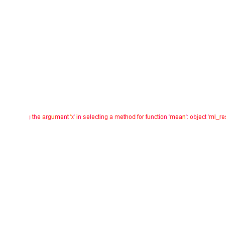

# Table of Contents

1.  [Introduction to programming CSC 100](#org46da0ec)
2.  [Introduction to advanced data science DSC 205](#orgd5a641d)
3.  [Machine learning DSC 305](#orgb34ec74)
4.  [Digital humanities CSC 105](#orge6a58d8)

# Introduction to programming CSC 100

-   This section contains visualization of test results for the
    Introduction to Programming class CSC 100 in Spring 2023.

-   The  visualizations were  created with  the statistical  programming
    language  R. If  you want  to know  more about  R or  even learn  it
    (fast), check out this excellent  tutorial by Norm Matloff, "fasteR:
    Fast Lane to Learning R!" for non-computer scientists.

## Getting the data

Save test results to data frames:

-   Save directory and individual files
-   `paste` and save as `file` string for `read.csv`
-   import with `read.csv`, `header=TRUE` and `stringsAsFactors=TRUE`.
    
        cc_dir <- c("w:/My Drive/spring23/cc/grades/")
        
        cc_test_1="2023-01-23T2039_Grades-CSC_100.csv"
        
        file_1 <- paste(cc_dir,cc_test_1,sep="")
        
        cc_test_1 <- read.csv(file_1, header=TRUE, stringsAsFactors=TRUE)
        
        cc_results_1 <- na.omit(cc_test_1$"Test.1..6701."[2:15])
        cc_results_1
    
         [1] 8.83 7.50 8.00 7.33 7.50 9.67 7.08 7.83 7.17 8.00 7.67 6.83 8.17
        attr(,"na.action")
        [1] 14
        attr(,"class")
        [1] "omit"

## Plotting the data

Density distribution plotting:

-   compute the averages for each results vector
-   determine min and max values for the plotting window
-   plot densities and averages and attach text labels
    
        cc_avg_1 <- mean(cc_results_1);
        cc_density_1 <- density(cc_results_1)
        
        par(mfrow=c(1,2),pty='s')
        hist(x=cc_results_1,
             main="Histogram",
             xlab="Points in [0,10]")
        
        plot(x=cc_density_1, col="black",
             main="Density estimate",
             xlab=paste("N=",length(cc_results_1),"participants"))
        abline(v=cc_avg_1, col="blue", lty=3)
        text(x=8.3, y=0.5, adj=0,
             col="blue",
             label=paste("mean:",format(cc_avg_1,digits=3)));
    
    

# Introduction to advanced data science DSC 205

-   This section contains visualization of test results for the
    "Introduction to advanced data science" class DSC 205 in
    Spring 2023.

## Getting the data

-   Enter vector data manually
-   Non-writing participants are registered as `NA`
-   Tests carried different number of available points

    ## Test 1 had 12 points
    ds2_results_1 <- c(6.75, 9.25, 6.75, 7.25, 8.75, 7, 6, 8, NA)/12 * 100
    format(ds2_results_1,digits=3)
    ## Test 2 had 10 points
    ds2_results_2 <- c(7, 9.5, 10, 8.5, 10, 4, NA, 9, 9)/10 * 100
    format(ds2_results_2,digits=3)

    [1] "56.2" "77.1" "56.2" "60.4" "72.9" "58.3" "50.0" "66.7" "  NA"
    [1] " 70" " 95" "100" " 85" "100" " 40" " NA" " 90" " 90"

## Plotting the data

Density distribution plotting:

-   compute the averages for each results vector (without `NA`)
-   determine min and max values for the plotting window
-   plot densities and averages and attach text labels
-   Color palette are Illinsky and Steele's recommended colors (except
    white): red, green, yellow, blue, black, pink, cyan, gray, orange,
    brown, purple
    
        ds2_avg_1 <- mean(ds2_results_1, na.rm=TRUE);
        ds2_density_1 <- density(ds2_results_1, na.rm=TRUE)
        ds2_avg_2 <- mean(ds2_results_2, na.rm=TRUE);
        ds2_density_2 <- density(ds2_results_2, na.rm=TRUE)
        plot(x=ds2_density_1, col="red", lwd=2,
             main="Test results DSC 205 - Spring 2023",
             xlab="Percentage (%)",
             xaxt="n",yaxt="n",ylab="")
        par(new=TRUE)
        plot(x=ds2_density_2, col="green", lwd=2,
             main="", xlab="", yaxt="n", ylab="")
        abline(v=ds2_avg_1, col="red", lty=3, lwd=2)
        abline(v=ds2_avg_2, col="green", lty=3, lwd=2)
        legend("topleft",
               legend=c(
                 paste("Test 1 (",format(ds2_avg_1,digits=3),"%)"),
                 paste("Test 2 (",format(ds2_avg_2,digits=3),"%)")),
               lwd=2, col=c(test1="red",
                            test2="green"),
               bty="n")
    
    

# Machine learning DSC 305

-   This section contains visualization of test results for the
    "Machine Learning" class DSC 305 in Spring 2023.

## Getting the data

Save test results to data frames:

-   Save directory and individual files
-   `paste` and save as `file` string for `read.csv`
-   import with `read.csv`, `header=TRUE` and `stringsAsFactors=TRUE`.
    
        ml_dir <- c("w:/My Drive/spring23/ml/grades/")
        
        ml_test_1="2023-01-26T0908_Grades-DSC_305.csv"
        
        file_1 <- paste(ml_dir,ml_test_1,sep="")
        
        ml_test_1 <- read.csv(file_1, header=TRUE, stringsAsFactors=TRUE)
        
        ml_results_1 <- na.omit(ml_test_1$"Test.1..6737."[2:23])
        ml_results_1
    
         [1]  9.37  8.03 11.43 10.73 11.17 12.20  8.40 10.00 11.43 11.40  9.65  8.17
        [13]  8.40 10.17 12.33 11.47 10.00  8.73 11.73
        attr(,"na.action")
        [1] 14 19 22
        attr(,"class")
        [1] "omit"

## Plotting the data

Density distribution plotting:

-   compute the averages for each results vector
-   determine min and max values for the plotting window
-   plot densities and averages and attach text labels
-   in the text label, correct for participants who did not write the
    test
    
        ml_avg_1 <- mean(ml_results_1);
        ml_density_1 <- density(ml_results_1)
        
        par(mfrow=c(1,2),pty='s')
        hist(x=ml_results_1,
             main="Histogram",
             xlab="Points in [0,15]")
        
        plot(x=ml_density_1, col="black",
             main="Density estimate",
             xlab=paste("N=",length(ml_results_1),"participants"))
        abline(v=ml_avg_1, col="blue", lty=3)
        text(x=6, y=0.21, adj=0,
             col="blue",
             label=paste("mean:",
                         format(ml_avg_1,
                                digits=3)))
        ##           format(100*ml_avg_1/15,digits=3),
        ##           "%"));
    
    

# Digital humanities CSC 105

